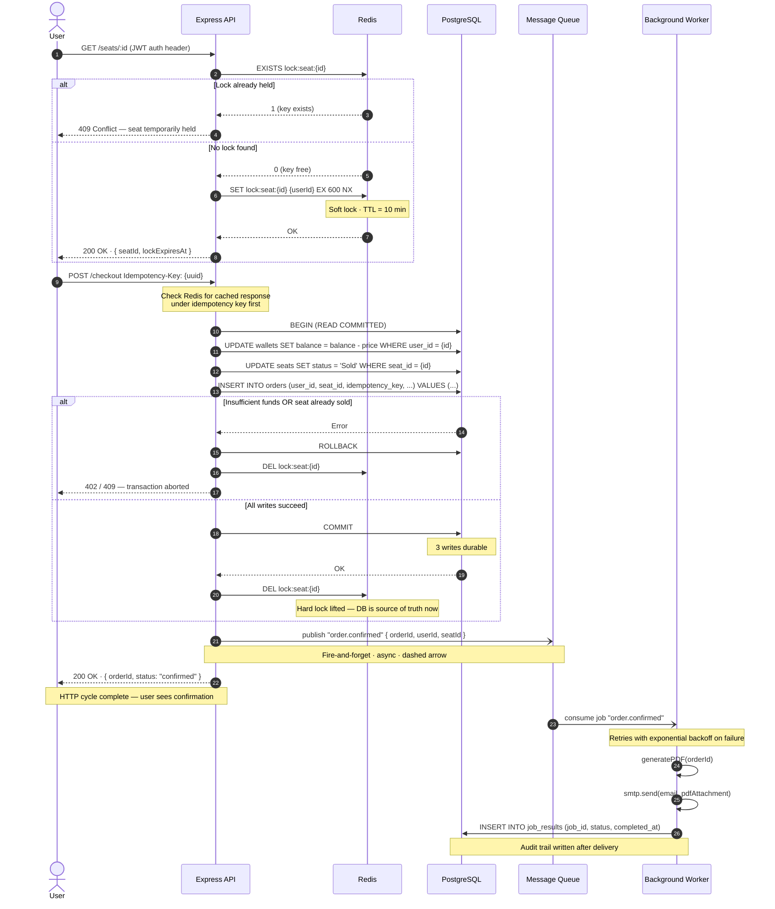

# Ticketing API — Checkout Sequence Diagram

> View this file in VS Code with **Cmd/Ctrl + Shift + V** (Markdown Preview).  
> Mermaid diagrams render natively — no extension required in VS Code 1.70+.

---

---

## Flow summary

| Step | Actor(s) | Mechanism | Pattern |
|------|----------|-----------|---------|
| 1 | User → API | Seat availability check | Sync HTTP |
| 2–3 | API ↔ Redis | Lock existence check + `SET NX EX 600` | Atomic soft lock |
| 4 | API → User | Seat held, show payment form | Sync HTTP |
| 5 | User → API | Payment with `Idempotency-Key` header | Sync HTTP |
| 6 | API → PostgreSQL | `BEGIN` transaction | Pessimistic write |
| 7 | API → PostgreSQL | Deduct balance · set `Sold` · insert order | 3 writes, 1 tx |
| 8 | API → PostgreSQL | `COMMIT` | Durability guarantee |
| 9 | API → Queue | Publish `order.confirmed` event | Async, fire-and-forget |
| 10 | API → User | `200 OK` with order confirmation | Sync HTTP |
| 11 | Queue → Worker | Consume job, generate PDF, send email | Async, retryable |

## Key architectural decisions

**Redis `SET NX EX 600`** — single atomic command prevents TOCTOU races. Two concurrent requests both doing `EXISTS` then `SET` would break isolation; `SET NX` collapses it into one operation.

**Idempotency key stored in DB** — if Redis is flushed, the API falls back to a DB lookup by `idempotency_key` to detect duplicate submissions. Exactly-once semantics survive cache restarts.

**Publish after `COMMIT`, before response** — the order is durable before the job fires. If the queue is down, the `200 OK` still goes out; a separate outbox poller can re-enqueue from `orders WHERE notified = false`.

**Worker retries via BullMQ** — exponential backoff means transient SMTP failures don't lose the email. The `job_results` write gives an audit trail for observability.
